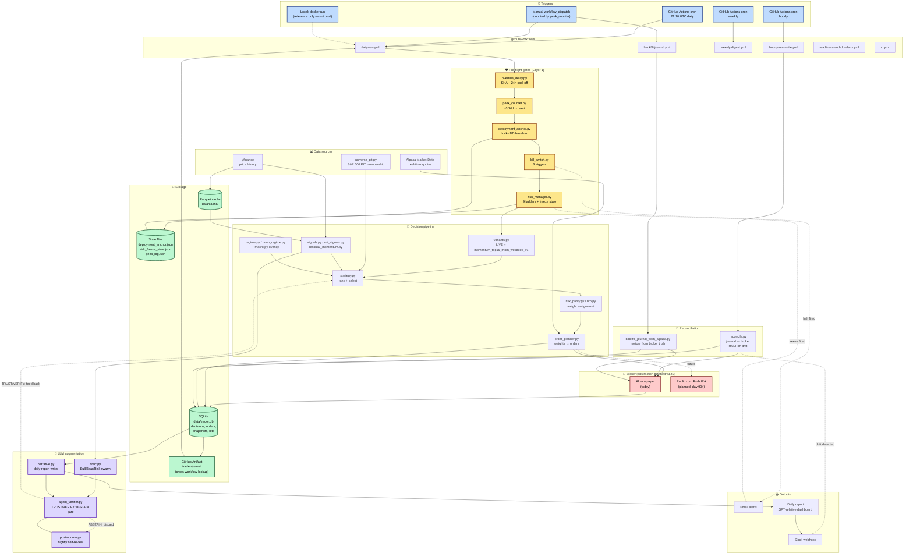
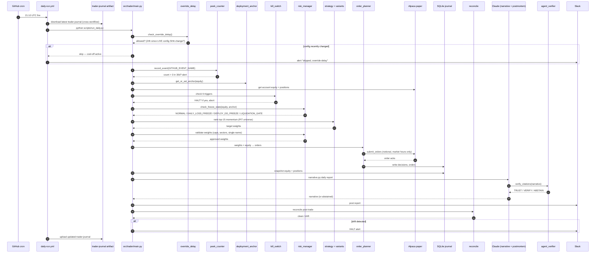
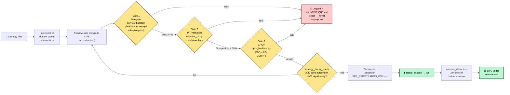
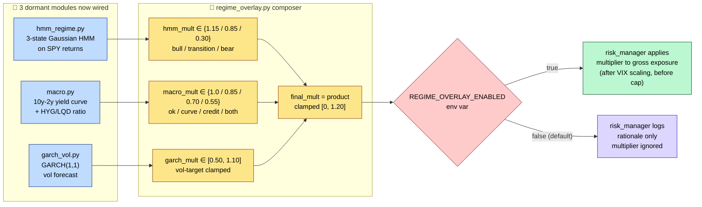
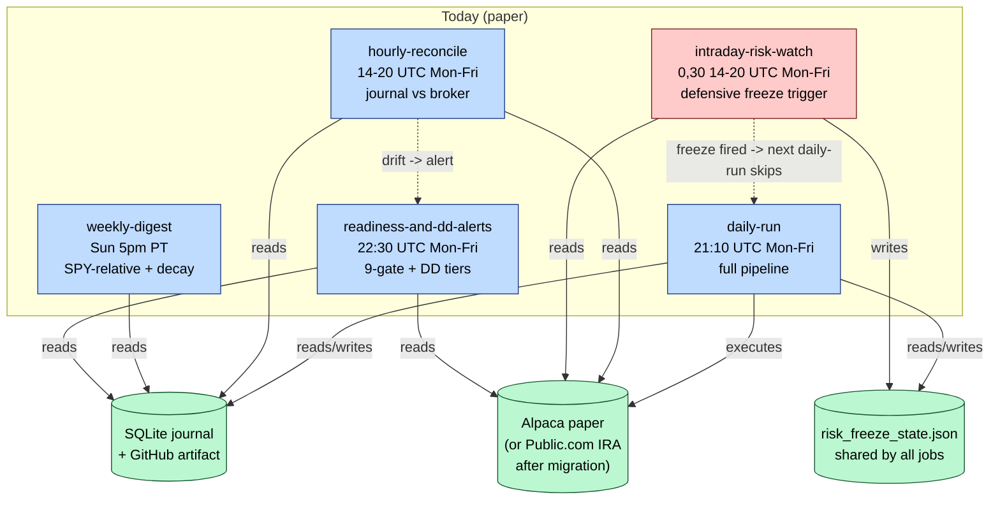
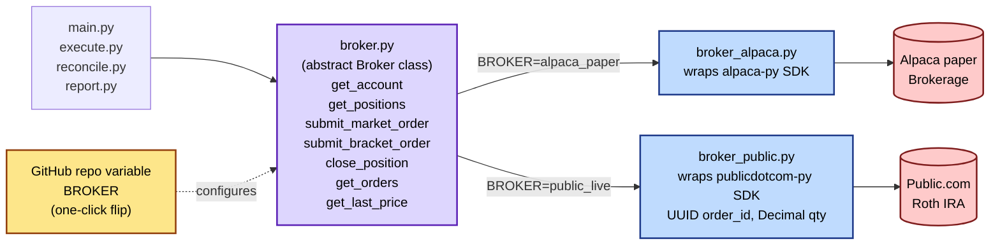

# Architecture diagrams

GitHub renders Mermaid natively — view this file on github.com to see the rendered diagrams.

---

## 1. System overview (where everything lives)

---

## 2. Daily run sequence (what happens at 21:10 UTC)

---

## 3. Promotion pipeline (3-gate methodology)

---

## 4. Defense-in-depth — 4 layers

```mermaid
flowchart TB
    subgraph L1["🔧 Layer 1 — Code (this repo)"]
        L1a["override_delay<br/>24h cool-off on config change"]
        L1b["peek_counter<br/>limit manual triggers"]
        L1c["deployment_anchor<br/>DD math anchored at deploy"]
        L1d["kill_switch — 6 triggers"]
        L1e["risk_manager — 9 ladders<br/>+ DAILY_LOSS / DEPLOY_DD / LIQUIDATION freezes"]
        L1f["agent_verifier<br/>TRUST/VERIFY/ABSTAIN for LLM outputs"]
        L1g["validation — empty/short/stale data raises"]
        L1h["reconcile — HALT on drift"]
    end

    subgraph L2["🏦 Layer 2 — Custodian (broker)"]
        L2a["Alpaca paper / Public.com IRA<br/>NBBO, settlement, regulatory limits<br/>PDT exemption in Roth"]
    end

    subgraph L3["🧑 Layer 3 — Human checkpoint"]
        L3a["BEHAVIORAL_PRECOMMIT.md (signed)<br/>no override after −15% DD<br/>no doubling down<br/>liquidation gate → 7d cool-off + post-mortem"]
        L3b["Spousal pre-brief required<br/>before LIVE flip"]
    end

    subgraph L4["📜 Layer 4 — Document trail"]
        L4a["CRITIQUE.md — kill list"]
        L4b["PRE_REGISTRATION_OOS.md<br/>commits to params before shadow runs"]
        L4c["RESEARCH.md / PAPER.md / ARCHITECTURE.md"]
        L4d["GO_LIVE_CHECKLIST.md — 9 automated gates"]
    end

    REAL_MONEY["💵 Real money in Roth IRA"]

    L1 ==> L2 ==> L3 ==> L4 ==> REAL_MONEY

    classDef code fill:#bfdbfe,stroke:#1e3a8a,stroke-width:2px,color:#000
    classDef broker fill:#fde68a,stroke:#92400e,stroke-width:2px,color:#000
    classDef human fill:#bbf7d0,stroke:#14532d,stroke-width:2px,color:#000
    classDef doc fill:#ddd6fe,stroke:#5b21b6,stroke-width:2px,color:#000
    classDef money fill:#fecaca,stroke:#7f1d1d,stroke-width:3px,color:#000

    class L1a,L1b,L1c,L1d,L1e,L1f,L1g,L1h code
    class L2a broker
    class L3a,L3b human
    class L4a,L4b,L4c,L4d doc
    class REAL_MONEY money
```

---

## 5. Regime overlay composer (v3.49.0 — wired into LIVE)

## 6. Multi-frequency monitoring loop (v3.49.0 — intraday risk added)

## 7. Broker abstraction (planned, day 60-75)

---

## Where things actually run (today vs future)

| Component | Today | Future (post day 90) |
|---|---|---|
| Daily orchestrator | GitHub Actions cron | GitHub Actions cron |
| Hourly reconcile | GitHub Actions cron | GitHub Actions cron |
| Weekly digest | GitHub Actions cron | GitHub Actions cron |
| Backfill | Manual workflow_dispatch | Manual workflow_dispatch |
| Local debugging | `python scripts/run_daily.py` | same |
| Container | `Dockerfile` exists but **not in prod** — reference for Lightsail/Fly migration if we outgrow GitHub Actions | possibly Cloud Run if needed |
| Brokerage | Alpaca paper | **Public.com Roth IRA** (via broker abstraction) |
| Journal | SQLite + GitHub artifact | same (or Cloud SQL if migrate) |
| Secrets | `.env` local, GitHub secrets in CI | same + Public.com keys added |

---

## Reading order for new contributors

1. Top of `README.md` — what the system does + current state
2. This file — visual mental model
3. `docs/CRITIQUE.md` — what we tried and killed (so you don't re-propose)
4. `docs/PAPER.md` — research framework + evaluation methodology
5. `src/trader/main.py` — entry point; trace through it once
6. `src/trader/variants.py` — read the LIVE variant
7. `src/trader/risk_manager.py` — the ladders that protect real money
8. `docs/SWARM_VERIFICATION_PROTOCOL.md` — required before spawning any LLM agent
9. `docs/MIGRATION_ALPACA_TO_PUBLIC.md` — the next big piece of work
10. `docs/BEHAVIORAL_PRECOMMIT.md` — the human checkpoint
