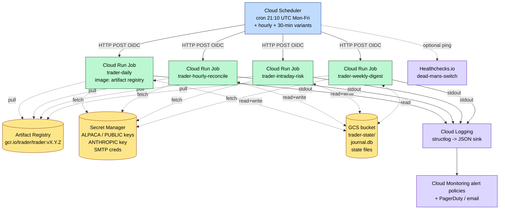

# GCP deployment plan

**Status:** documented, not yet executed. Cuts over the same week as
`BROKER=public_live`. Today the trader runs on GitHub Actions cron.

## Why migrate

Per `docs/ARCHITECT_TRADER_DEBATE.md` — both personas converged: GitHub
Actions is fine for paper but has real ops gaps for live money:

- **No "didn't run at all" alarm.** If the cron silently skips, we don't
  know until the user notices.
- **GitHub Actions cron is best-effort** — advertised "may be delayed
  during high load." Acceptable for paper, not for live.
- **Single-point dependency on GitHub infra.** A multi-day GitHub outage =
  no trades.
- **Observability is "tail the workflow log."** No structured queries,
  no metrics, no alerting beyond what we manually wire up.

Cloud Run + Scheduler fixes all 4 with $5-15/month cost.

## Target architecture



## Components in detail

### 1. Artifact Registry (image hosting)

```bash
# One-time
gcloud artifacts repositories create trader \
  --repository-format=docker \
  --location=us-central1 \
  --description="trader prod images"

# Per release — uses existing Dockerfile (production), NOT Dockerfile.test
docker build -t us-central1-docker.pkg.dev/$PROJECT_ID/trader/trader:v3.49.2 .
docker push us-central1-docker.pkg.dev/$PROJECT_ID/trader/trader:v3.49.2
docker tag us-central1-docker.pkg.dev/$PROJECT_ID/trader/trader:v3.49.2 \
            us-central1-docker.pkg.dev/$PROJECT_ID/trader/trader:latest
docker push us-central1-docker.pkg.dev/$PROJECT_ID/trader/trader:latest
```

Cost: ~$0.10/GB/month for image storage. Image is ~800MB; expect ~$0.10/mo.

### 2. Secret Manager (broker + API keys)

```bash
# One-time per secret
gcloud secrets create alpaca-api-key --data-file=- <<< "$ALPACA_API_KEY"
gcloud secrets create alpaca-api-secret --data-file=- <<< "$ALPACA_API_SECRET"
gcloud secrets create public-api-secret --data-file=- <<< "$PUBLIC_API_SECRET"
gcloud secrets create public-account-number --data-file=- <<< "$PUBLIC_ACCOUNT_NUMBER"
gcloud secrets create anthropic-api-key --data-file=- <<< "$ANTHROPIC_API_KEY"
gcloud secrets create smtp-user --data-file=- <<< "$SMTP_USER"
gcloud secrets create smtp-pass --data-file=- <<< "$SMTP_PASS"

# Grant the Cloud Run service account access
SA_EMAIL=trader-runner@${PROJECT_ID}.iam.gserviceaccount.com
gcloud iam service-accounts create trader-runner --display-name="trader Cloud Run runner"
for SECRET in alpaca-api-key alpaca-api-secret public-api-secret public-account-number anthropic-api-key smtp-user smtp-pass; do
  gcloud secrets add-iam-policy-binding $SECRET \
    --member="serviceAccount:$SA_EMAIL" \
    --role="roles/secretmanager.secretAccessor"
done
```

Cost: $0.06 per 10k accesses. Each Cloud Run job pulls ~7 secrets. At 5
daily + 7 hourly + 14 intraday + 1 weekly = ~27 runs/day × 7 secrets =
~189 accesses/day. **<$0.04/mo.**

### 3. GCS bucket (journal + state persistence)

```bash
gcloud storage buckets create gs://${PROJECT_ID}-trader-state \
  --location=us-central1 \
  --uniform-bucket-level-access

gcloud storage buckets add-iam-policy-binding gs://${PROJECT_ID}-trader-state \
  --member="serviceAccount:$SA_EMAIL" \
  --role="roles/storage.objectAdmin"
```

The journal moves from "GitHub Actions artifact" to "GCS object." Each
Cloud Run invocation downloads `journal.db` + state files at start, uploads
at end. Same logical model, cleaner storage.

Cost: ~$0.02/GB/month + tiny egress. Journal is <100MB; expect <$0.01/mo.

**Code change required:** new `src/trader/state_store.py` with two
backends — GitHubArtifact (today) and GCS (new). Switch via env var
`STATE_BACKEND=github_artifact|gcs`. ~80 LOC, 1 hour.

### 4. Cloud Run jobs (one per workflow)

```bash
gcloud run jobs create trader-daily \
  --image=us-central1-docker.pkg.dev/$PROJECT_ID/trader/trader:latest \
  --region=us-central1 \
  --service-account=$SA_EMAIL \
  --task-timeout=20m \
  --max-retries=0 \
  --command="python" --args="scripts/run_daily.py,--force" \
  --set-env-vars="BROKER=public_live,STATE_BACKEND=gcs,STATE_BUCKET=$PROJECT_ID-trader-state" \
  --set-secrets="PUBLIC_API_SECRET=public-api-secret:latest,PUBLIC_ACCOUNT_NUMBER=public-account-number:latest,ANTHROPIC_API_KEY=anthropic-api-key:latest,SMTP_USER=smtp-user:latest,SMTP_PASS=smtp-pass:latest"

# Same shape for trader-hourly-reconcile, trader-intraday-risk, trader-weekly-digest
# Just change the args + task-timeout.
```

Cost: 4 jobs × ~5min/run × ~27 runs/day × $0.000024/vCPU-second ≈
**$0.04/day = ~$1.20/mo**. Plus a tiny memory cost. Total Cloud Run:
**$2-5/mo**.

### 5. Cloud Scheduler (cron triggers)

```bash
gcloud scheduler jobs create http trader-daily-trigger \
  --location=us-central1 \
  --schedule="10 21 * * 1-5" \
  --time-zone="UTC" \
  --uri="https://us-central1-run.googleapis.com/apis/run.googleapis.com/v1/namespaces/$PROJECT_ID/jobs/trader-daily:run" \
  --http-method=POST \
  --oidc-service-account-email=$SA_EMAIL \
  --oidc-token-audience="https://us-central1-run.googleapis.com/"

# trader-hourly: "0 14-20 * * 1-5"
# trader-intraday: "0,30 14-20 * * 1-5"
# trader-weekly: "0 0 * * 1"
```

Cost: $0.10/month per job. 4 jobs = **$0.40/mo**.

### 6. Cloud Logging + Monitoring (alerts)

```bash
# Alert on any Cloud Run job failure (non-zero exit)
gcloud alpha monitoring policies create --policy-from-file=- <<EOF
displayName: "trader Cloud Run job failure"
conditions:
  - displayName: "Job execution failed"
    conditionThreshold:
      filter: 'metric.type="run.googleapis.com/job/completed_execution_count" AND resource.type="cloud_run_job" AND metric.label.result="failed"'
      comparison: COMPARISON_GT
      thresholdValue: 0
      duration: 60s
notificationChannels:
  - "projects/$PROJECT_ID/notificationChannels/<email-channel-id>"
EOF

# Alert on missing daily-run (no successful execution in 25h Mon-Fri)
# This is the "didn't run at all" alarm we don't have today.
gcloud alpha monitoring policies create --policy-from-file=- <<EOF
displayName: "trader-daily missed execution"
conditions:
  - displayName: "No successful daily-run in 25h"
    conditionAbsent:
      filter: 'metric.type="run.googleapis.com/job/completed_execution_count" AND resource.type="cloud_run_job" AND resource.label.job_name="trader-daily" AND metric.label.result="succeeded"'
      duration: 90000s  # 25h
notificationChannels:
  - "projects/$PROJECT_ID/notificationChannels/<email-channel-id>"
EOF
```

Cost: free tier covers our volume.

### 7. Optional: Healthchecks.io (defense-in-depth)

In addition to Cloud Monitoring, add `curl https://hc-ping.com/<uuid>` to
the end of each Cloud Run job. Healthchecks pages you if a ping is
missing — independent monitor in case Cloud Monitoring itself fails.

Cost: free tier (20 checks).

### 8. CI/CD: GitHub Actions builds & pushes; Cloud Run pulls

```yaml
# .github/workflows/build-and-push-image.yml
name: build-and-push-image
on:
  push:
    branches: [master]
    tags: ['v*']
jobs:
  build:
    runs-on: ubuntu-latest
    steps:
      - uses: actions/checkout@v4
      - uses: google-github-actions/auth@v2
        with:
          workload_identity_provider: ${{ secrets.GCP_WIF_PROVIDER }}
          service_account: github-actions@${{ secrets.GCP_PROJECT_ID }}.iam.gserviceaccount.com
      - uses: google-github-actions/setup-gcloud@v2
      - run: |
          gcloud auth configure-docker us-central1-docker.pkg.dev
          IMAGE=us-central1-docker.pkg.dev/${{ secrets.GCP_PROJECT_ID }}/trader/trader
          TAG=${GITHUB_REF_NAME:-master-${GITHUB_SHA:0:7}}
          docker build -t $IMAGE:$TAG -t $IMAGE:latest .
          docker push $IMAGE:$TAG
          docker push $IMAGE:latest
          # Tell Cloud Run jobs to use the new image
          for JOB in trader-daily trader-hourly-reconcile trader-intraday-risk trader-weekly-digest; do
            gcloud run jobs update $JOB --image=$IMAGE:latest --region=us-central1
          done
```

Workload Identity Federation = no JSON key files in GitHub secrets.

## Total cost estimate

| Component | Monthly |
|---|---|
| Artifact Registry storage | ~$0.10 |
| Secret Manager accesses | ~$0.04 |
| GCS bucket | ~$0.01 |
| Cloud Run job execution | $2-5 |
| Cloud Scheduler | $0.40 |
| Cloud Logging | free tier |
| Cloud Monitoring + alerts | free tier |
| **Total** | **~$3-6/month** |

For a $25k Roth IRA aiming at 19% CAGR, $5/mo infrastructure cost = 0.024%
annual drag. Acceptable.

## Migration sequence

**Pre-cutover (do these once, in order):**

1. **Build the broker abstraction** (`src/trader/broker.py` + Alpaca + Public adapters). Per `docs/MIGRATION_ALPACA_TO_PUBLIC.md`. Test in container.
2. **Build the GCS state backend** (`src/trader/state_store.py`). Test in container.
3. **Provision GCP resources**: Artifact Registry, Secret Manager, GCS bucket, IAM service account. ~30 min.
4. **Push first image** to Artifact Registry. ~10 min.
5. **Create Cloud Run jobs** (4 of them). ~10 min.
6. **Create Cloud Scheduler triggers** (4 of them). ~10 min.
7. **Provision Cloud Monitoring alert policies** + email notification channel.
8. **Wire CI/CD** GitHub Actions workflow to push images on merge.

**Cutover day (parallel run):**

9. **Manual trigger** Cloud Run `trader-daily` with `BROKER=alpaca_paper`. Verify it works against the same paper account as the existing GitHub Actions cron.
10. **Run for 1 week in parallel** — both GitHub Actions cron AND Cloud Run firing daily on the same paper account. Reconcile output should be IDENTICAL because both write to the same GCS journal.
11. **If outputs match**: disable GitHub Actions cron schedule (keep workflow files for emergency fallback). Cloud Run is now the trigger.
12. **Day +7**: flip `BROKER=public_live` in Cloud Run env. Override-delay catches the SHA change → 24h cool-off. Day +8 first live trade.

## Rollback plan

If Cloud Run misbehaves: `gcloud scheduler jobs pause trader-daily-trigger`
+ re-enable the GitHub Actions cron. Same image, same code, same broker —
just different trigger. Rollback is one CLI command.

## What this DOESN'T fix

- **Strategy bugs.** Cloud Run runs the same code; doesn't fix the
  rich-report `name 'alpha' is not defined` cosmetic bug or any other
  logic issue.
- **Broker outages.** If Public.com is down, no trader rebalances —
  same as today.
- **Data outages.** If yfinance breaks, the universe ranking fails —
  same as today.
- **Bad strategy.** No infra change makes a -33% drawdown not happen.

## Defer (post-GCP, if needed)

- **Cloud SQL** for journal (instead of single-file SQLite in GCS). Worth
  it if multi-instance read consistency matters. Today: not yet.
- **Pub/Sub** for event-driven triggering (e.g., FOMC reactor on actual
  Fed announcement, not just calendar). Worth it for the FOMC reactor
  in Tier C.
- **Cloud Trace** for distributed tracing. Worth it once we have multiple
  services calling each other. Today: monolith.
- **VPC Service Controls** for tighter security perimeter. Overkill for
  personal account.

## Owner: when

Both personas in `ARCHITECT_TRADER_DEBATE.md` agreed: **same week as
`BROKER=public_live` flip**, around day 90 of the live-arming clock.
Per `README.md` "Live-arm checklist" — gates 7-13 cover the technical
prerequisites; this doc is gate 14 (implicit) and gate 11 (one-click flip).

Estimated effort: **8h focused work** for steps 1-8 (one full day), plus
1 week of parallel-run validation in step 10.
